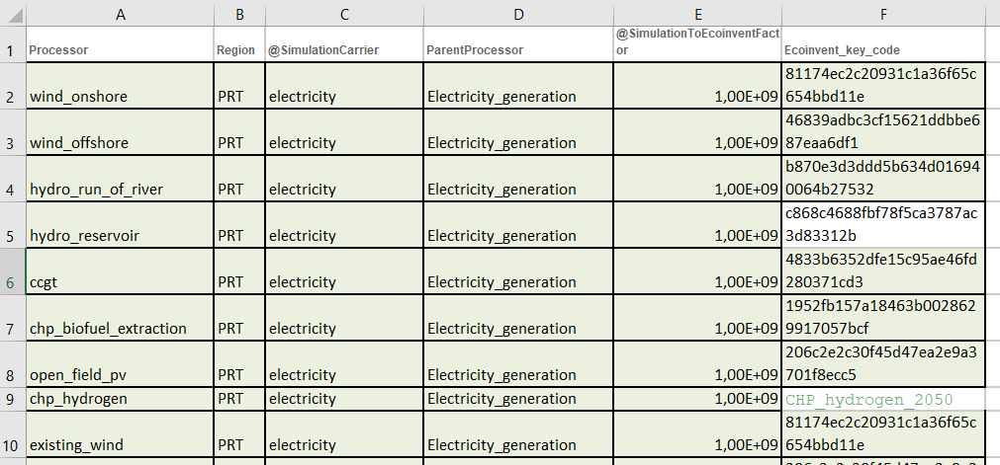

# Sparks
Sparks facilitates the creation of inputs for [enbios](https://github.com/LIVENlab/enbios) through an Excel file.
It has been specifically design to match [Calliope](https://github.com/calliope-project/calliope) outputs with Enbios.

Please note that this repository is currently undergoing several updates.
The following functions have not been implemented yet:
- Group subregions
- Double counting
